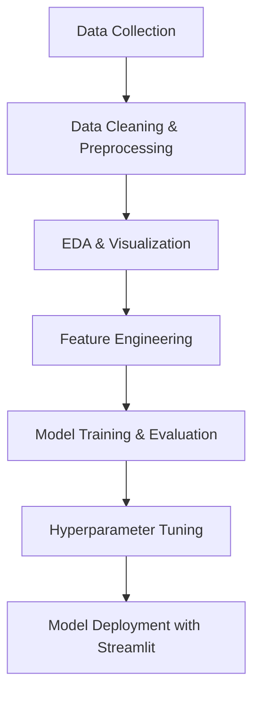

# 🧠 Machine Learning Project — AQI Prediction 🌿

## 📋 Overview
This project focuses on predicting the **Air Quality Index (AQI)** using various **pollutant concentration features** such as PM2.5, PM10, NO₂, SO₂, CO, and O₃.
The model leverages advanced **machine learning algorithms** and a **robust preprocessing pipeline** to deliver accurate predictions and meaningful environmental insights.

---

## 🚀 Objectives
- Analyze air pollution trends and correlations among pollutants.
- Build a scalable **end-to-end ML pipeline** for AQI prediction.
- Compare different regression models (Linear, Tree-based, Ensemble, ANN).
- Deploy a user-friendly web app using **Streamlit** for real-time AQI prediction.

---

## 🧩 Project Workflow



---

## 🧰 Tech Stack

| Category | Tools / Libraries |
|-----------|-------------------|
| **Language** | Python 3.x |
| **Data Handling** | Pandas, NumPy |
| **Visualization** | Matplotlib, Seaborn, Plotly |
| **Preprocessing** | Scikit-learn, Imbalanced-learn |
| **Modeling** | Linear Regression, Decision Tree, Random Forest, XGBoost, MLPRegressor |
| **Deployment** | Streamlit |
| **Others** | Joblib, Pipeline, ColumnTransformer |

---

## 📂 Project Structure

```
AQI_Prediction/
│
├── data/
│   ├── raw_data.csv
│   ├── processed_data.csv
│
├── notebooks/
│   ├── 01_EDA.ipynb
│   ├── 02_Model_Training.ipynb
│
├── ML_Model/
│   ├── aqi_prediction.pkl
│
├── src/
│   ├── data_preprocessing.py
│   ├── model_pipeline.py
│   ├── evaluation.py
│
├── app/
│   ├── streamlit_app.py
│
├── requirements.txt
├── README.md
└── LICENSE
```

---

## ⚙️ Model Training Pipeline

- **Missing Value Handling** → `SimpleImputer` / `KNNImputer`
- **Outlier Treatment** → IQR / Capping method
- **Feature Scaling** → `StandardScaler` / `MinMaxScaler`
- **Encoding** → OneHot / Ordinal Encoding
- **Model Evaluation Metrics** → R², MAE, RMSE

Example pipeline snippet:
```python
numeric_transformer = Pipeline(steps=[
    ('imputer', KNNImputer()),
    ('scaler', StandardScaler())
])

preprocessor = ColumnTransformer([
    ('num', numeric_transformer, numerical_features)
])

model = Pipeline(steps=[
    ('preprocessor', preprocessor),
    ('regressor', RandomForestRegressor(random_state=42))
])
```

---

## 📊 Results & Insights

- PM2.5 and PM10 are the dominant pollutants influencing AQI levels.
- Nitrogen-based pollutants (NO, NO₂, NOₓ) show strong correlation, indicating vehicular emissions as a major source.
- Ensemble methods (Random Forest, XGBoost) outperform linear models with higher R² and lower RMSE.

| Model | R² Score | RMSE |
|--------|-----------|------|
| Linear Regression | 0.68 | 45.2 |
| Decision Tree | 0.81 | 28.4 |
| Random Forest | **0.88** | **21.3** |
| XGBoost | **0.90** | **19.6** |

---

## 🌐 Deployment

The model is deployed via **Streamlit**, allowing users to input pollutant levels and get instant AQI predictions.

Run locally:
```bash
streamlit run app/streamlit_app.py
```

---

## 🧪 How to Run

1. **Clone the Repository**
   ```bash
   git clone https://github.com/your-username/AQI_Prediction.git
   cd AQI_Prediction
   ```

2. **Install Dependencies**
   ```bash
   pip install -r requirements.txt
   ```

3. **Run the Streamlit App**
   ```bash
   streamlit run app/streamlit_app.py
   ```

---

## 📈 Future Improvements
- Integrate **LSTM / RNN** models for time-series forecasting.
- Include **geographical features** for spatial AQI predictions.
- Automate data ingestion via APIs.
- Deploy using **Docker + CI/CD** pipeline for production.

---
